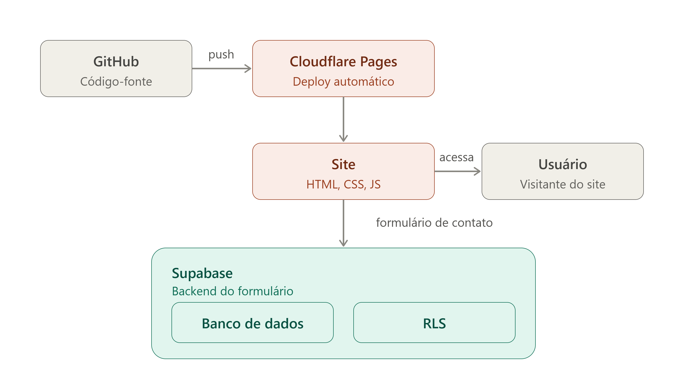

<h1>Portifólio</h1>

Portfólio pessoal desenvolvido com <strong>HTML, CSS e JavaScript</strong>, com
backend via <strong>Supabase</strong> para o formulário de contato. Projeto
construído com apoio do <strong>Claude Code</strong>, aplicando habilidades de
web design, UX e boas práticas de segurança.

<strong>Acesse o site:</strong>
<a href="https://portifolio-erikestv.pages.dev/" target="_blank">portifolio-erikestv.pages.dev</a>

<h2>Tecnologias utilizadas</h2>

<ul>
  <li><strong>HTML5</strong></li>
  <li><strong>CSS3</strong></li>
  <li><strong>JavaScript</strong></li>
  <li><strong>Supabase</strong> (banco de dados + RLS)</li>
  <li><strong>Cloudflare Pages</strong></li>
  <li><strong>GitHub</strong></li>
  <li><strong>Claude Code</strong></li>
</ul>

<h2>Funcionalidades</h2>

<ul>
  <li>Apresentação pessoal e profissional</li>
  <li>Exibição de projetos e habilidades</li>
  <li>Formulário de contato funcional, integrado ao Supabase</li>
  <li>Design responsivo para desktop e mobile</li>
  <li>Boas práticas de segurança na comunicação com o backend</li>
  <li>Deploy automático a cada atualização no repositório</li>
</ul>

<h2>Arquitetura</h2>

O código-fonte fica versionado no <strong>GitHub</strong> e é publicado
automaticamente no <strong>Cloudflare Pages</strong> a cada atualização. O
formulário de contato envia os dados para o <strong>Supabase</strong>, que
armazena as informações em um banco de dados protegido por
<strong>RLS (Row Level Security)</strong>, garantindo que apenas operações
autorizadas sejam permitidas.

<h2>Autor</h2>

Desenvolvido por <strong>Erik Estevam</strong> — 
<a href="https://github.com/erikestv" target="_blank">@erikestv</a>

